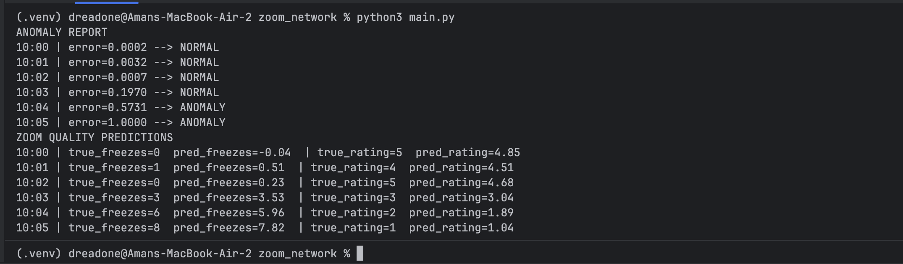

### Network Anomaly Detection + Zoom Quality Prediction

The purpose of this project is to detect irregular network behaviour and understand how it affects Zoom call performance. We do this by analysing logs, identifying anomalies using an unsupervised model, and then predicting call metrics using a supervised neural network.

1. Intent

The system answers two questions:

Is the network behaving abnormally?
We learn normal patterns (latency + packet_loss). If current behaviour deviates, it’s marked as an anomaly.

Given the network conditions, what will be the Zoom experience?
The model predicts freeze_count and call_rating to estimate user-side impact.

So basically:
First detect problems → then measure how badly Zoom will suffer.

2. Function Breakdown (with starting point clearly marked)
Starting Execution

Line 119- if __name__ == "__main__":
This kicks off the entire pipeline.

Order of execution:

1 Load + merge CSV logs

2 Normalize network features

3 Train Autoencoder for anomaly detection

4 Detect anomalies based on reconstruction error

5 Train Zoom performance predictor

6 Print anomaly report + prediction comparison output

Core Components

1) load_and_normalize() (line 5)

Reads network_logs.csv + zoom_logs.csv

Merges using timestamp

Extracts latency_ms & packet_loss

Normalizes feature values and returns
Output: merged dataframe + normalized tensor

2) train_autoencoder()  (line 40)

Unsupervised model learns normal traffic behaviour

Optimized using MSE reconstruction loss

After training, it knows what "normal" looks like
Output: trained autoencoder

3) detect_anomalies() (line 57)

Reconstructs input → compares with original

High error = unusual network condition

Threshold = 75th percentile (dynamic)
Output: reconstruction error + threshold + anomaly flags

4) train_zoom_model() (line 87)

Supervised NN predicting Zoom quality from network

Input = (latency, packet_loss)

Output = (freeze_count, call_rating)
Output: trained ZoomPredictor model

5) predict_zoom_quality() (line 102)

Runs prediction for every timestamp

Prints: actual vs predicted freeze & rating

Helps quantify impact of network on real Zoom performance
Output: readable comparison table in terminal

3. Input & Output
Expected Input Files
network_logs.csv   -> timestamp, latency_ms, packet_loss
zoom_logs.csv      -> timestamp, zoom_freeze_count, call_rating

The only requirement is matching timestamps so logs can align.

Sample:

network_logs.csv

timestamp,latency_ms,packet_loss
10:00,20,0.5
10:01,30,0.7

zoom_logs.csv

timestamp,zoom_freeze_count,call_rating
10:00,0,5
10:01,1,4

### Program Output

